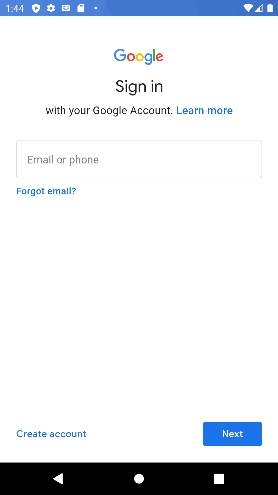
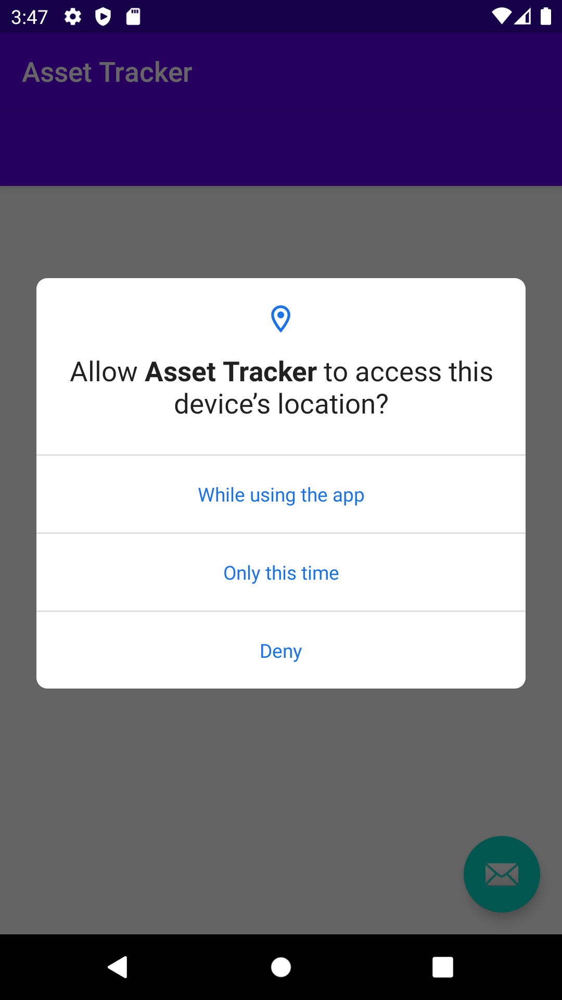
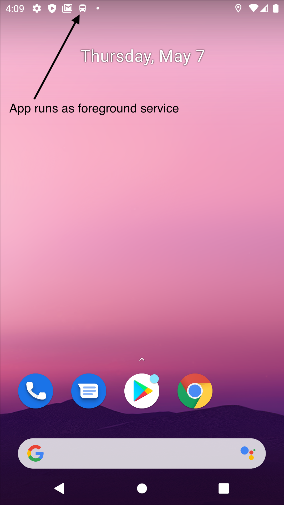
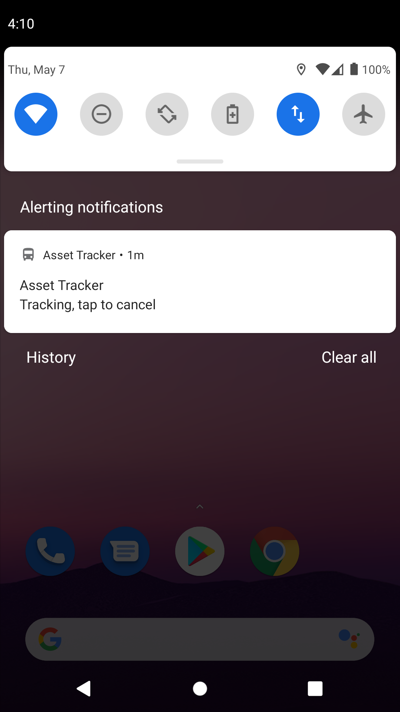
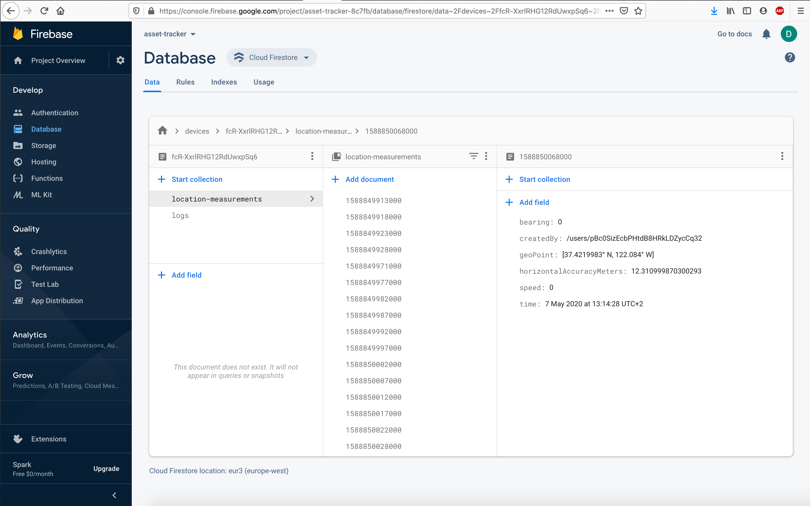

[](https://circleci.com/gh/inouiw/AssetTrackerServiceAndroid/tree/master)
[](https://app.codacy.com/manual/inouiw/AssetTrackerServiceAndroid/dashboard)

# Asset Tracker Service for Android
This android app runs a background service that saves the device location, speed, direction and other measurements every 10 seconds to a google firestore database. 
The full location history is available for live or deferred analysis.

## Deploying the app to an android phone
1. Install Android Studio.
1. Clone or download this repository.
1. Create a Firebase account because data is saved there. The free account is sufficient. See [console.firebase.google.com](https://console.firebase.google.com)
    1. In Firebase create a project, for example "asset-tracker".
    1. Navigate to Develop / Database  and open the Rules tab. Replace the contents with the content of the file `firestore.rules`. Click publish.
    1. Navigate to Authentication / Sign-in method and enable the Google sign-in provider.
    1. Navigate to  Project settings. There click on the android icon on the bottom. 
        1. For Android package name enter "com.example.assettracker".
        1. For Debug signing certificate SHA-1, enter the debug certificate SHA1 key. The command to get it is documented [here](https://developers.google.com/android/guides/client-auth). The SHA1 key is needed for Google Sign-in.
        1. Click Register app and then click Download google-services.json.
1. Copy the downloaded google-services.json to the /app folder.
1. Open the project in Android Studio.
1. Connect your android device with a usb cable.
1. Developer mode must be enabled on your phone.
1. Click Run or click Debug. The app will be compiled and be installed on your phone.
1. The app will ask you to log-in with your google account. This is only required the first time the app starts. Even after a reboot you do not need to log-in again.
1. A bus icon appears in the status bar to indicate that the service is running. Click it to stop the app.

## Accessing the location data
To see the generated data, login to the firebase account (see above) then navigate to Database and open the Data tab. You can access the Google Firestore database from android, iPhone
or a web app. Firestore can push data modifications to clients.

## Saved data

### Users: `/users/{userUid}`

- A user must have a google account but different log-in methods can be activated.
- A user may generate measurement data for zero or more devices.
- A user can read data hat s/he generated.
- A user can read data from other users if the other users grant permission.
 
 ``` javascript
 { 
     userUid: "qDrkd0i898cjJhEo3MDJZaxe2gO", // Type string
     email: "test@gmail.com", // Type string
     displayName: "Test User", // Type string
     accountCreatedAt: 2 May 2020 at 20:16:40 UTC+2, // Type timestamp
     authorizedUsers: ["pBc0SizEabPHtdB9FRkLDZycCq32"] // Type array of string
 }
 ```

### Devices: `/users/{userUid}/devices/{deviceId}`
 
 ``` javascript
 { 
     deviceId: "erEXZrc6QMOZgOL4YTLTlo", // Type string
     manufacturer: "CUBOT", // Type string
     model: "CUBOT ECHO", // Type string
     api: 23, // Type number
     firstLoginAt: 15 May 2020 at 13:04:56 UTC+2 // Type timestamp
 }
 ```

### Location-Measurements: `/users/{userUid}/devices/{deviceId}/location-measurements/{timestamp}`

``` javascript
{ 
    geoPoint: [50.4214267° N, 8.355768° E], // Type geopoint
    horizontalAccuracyMeters: 22.291000366210938, // Type number
    bearing: 271.8037109375, // Type number; horizontal direction of travel in degrees 0.0-360.0
    speed: 0.10250464826822281, // Type number; meters/second
    time: 4 May 2020 at 07:16:40 UTC+2 // Type timestamp
}
```

### Log Messages: `/users/{userUid}/devices/{deviceId}/logs/{timestamp}`

``` javascript
{ 
    time: 5 May 2020 at 22:44:37 UTC+2, // Type timestamp
    message: "App started", // Type string
    level: "INFO" // Type string
}
```

## Other things to know

- The app will not start automatically after a reboot. You need to click the app icon "Asset Tracker". 
- If the internet connection is lost, the location is recorded on the device and synced once the connection is reestablished.

## Screenshots






## Author
David Neuy

### License
MIT
